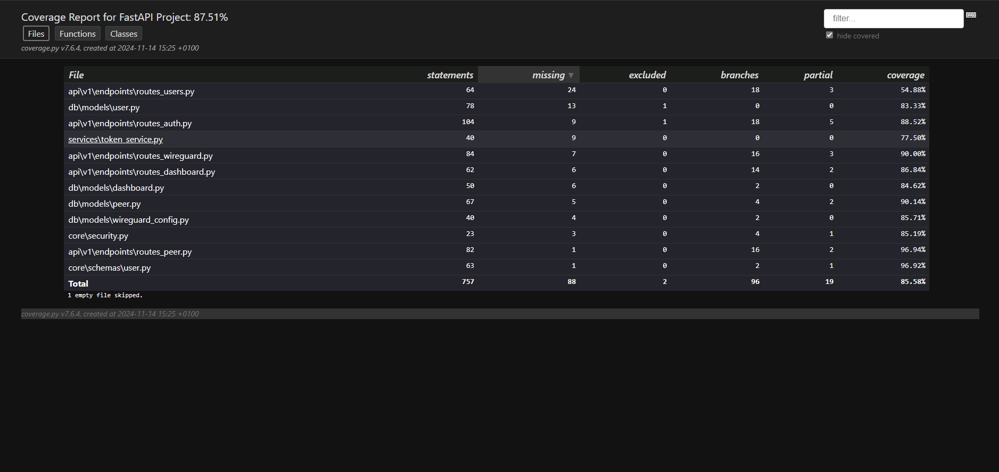
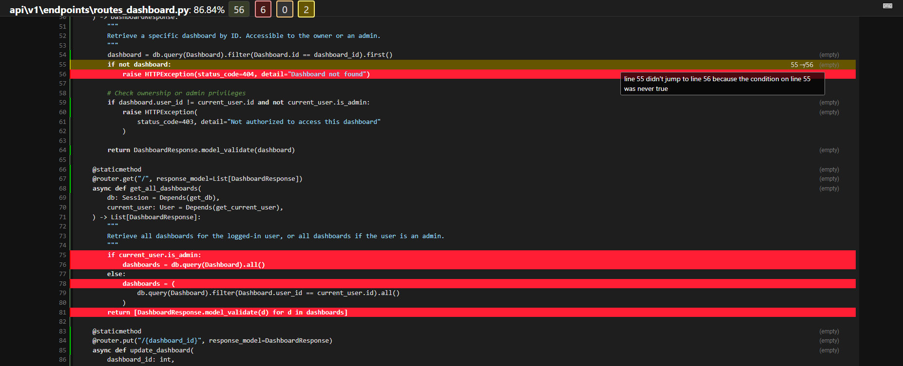
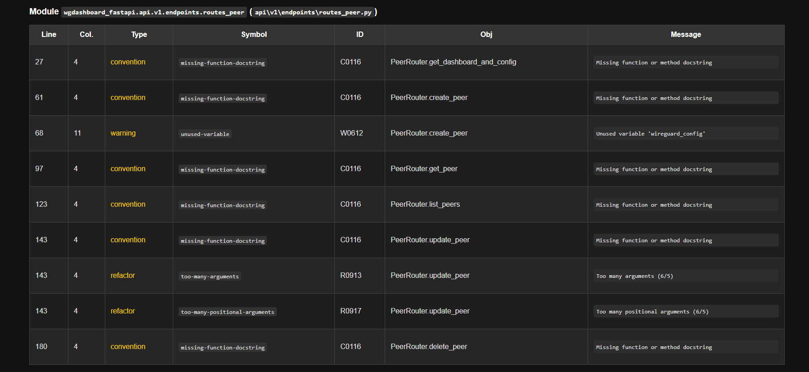
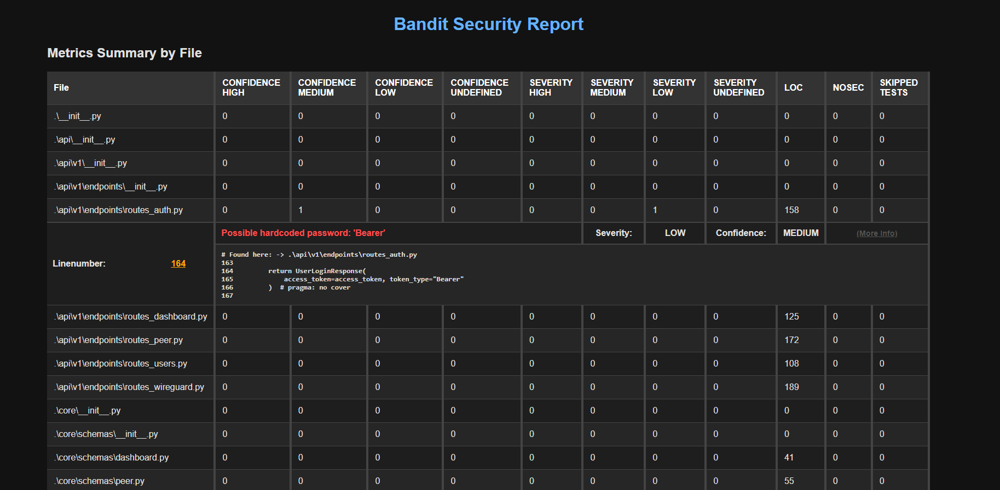

# Multi-Theme Reporting Styles

This repository contains a collection of custom CSS and HTML templates for displaying Python reports. The themes are
designed to make the reports visually appealing and easier to read, with a focus on dark mode and readability.

### Available Themes
- **Coverage**: A custom dark mode theme for HTML reports from [coverage.py](https://coverage.readthedocs.io/en/latest/).
- **Pylint**: A dark theme for displaying [Pylint](https://pylint.pycqa.org/) reports.
- **Bandit**: A dark theme for [Bandit](https://bandit.readthedocs.io/en/latest/) security reports.


### Usage

## 1. Coverage Theme




A custom dark mode CSS for `coverage.py`. This theme will automatically be applied to all HTML reports when the
preferred color scheme is set to `dark`.

**Installation:**

1. Download `coverage_dark_mode.css` to your project.
2. Link it to your `coverage.py` HTML report by adding it to the \<head\> section of your HTML file:

```html
<link rel="stylesheet" href="path/to/coverage_dark_mode.css">
```

**Example CSS:**

```css
@charset "UTF-8";
/* Dark mode styling */
@media (prefers-color-scheme: dark) {
    body {
        background-color: #121212;
        color: #e0e0e0;
    }
    /* Additional customizations... */
}
```

## 2. Pylint Theme



The Pylint theme for Jinja2 reports ensures an attractive and readable display of Pylint reports in dark mode.

**Usage:**

1. Download the HTML template for Pylint.
2. Integrate it into your Pylint reporting setup and ensure the appropriate dark mode CSS is included.

**Example CSS for Pylint:**

```css
body {
    background-color: #121212; /* Dark background */
    color: #e0e0e0; /* Light text */
}
h1, h2, h3 {
    color: #ffffff;
}
table {
    width: 100%;
    border-collapse: collapse;
    margin-top: 1em;
}
th, td {
    padding: 0.75em;
    border: 1px solid #444;
}
```

**Pylint Jinja2 Template:**

```html
<!DOCTYPE HTML>
<html lang="en">
<head>
    <title>Pylint report</title>
    <meta charset="utf-8">
    <meta name="description" content="auto generated pylint report from JSON">
    <style>
        /* Dark Mode Styling */
        body {
            padding: 1em;
            margin: 0;
            background-color: #121212; /* Dark background */
            color: #e0e0e0; /* Light text */
            font-family: sans-serif;
        }
        /* Additional adjustments for tables and report structures */
    </style>
</head>
<body>
<h1>Pylint report from {{ report.template_name }}</h1>
<!-- Report Content -->
</body>
</html>
```

## 3. Bandit Theme (Coming Soon)



A Bandit theme will also be provided in a suitable dark mode design to make security vulnerability reports more
readable. This theme will be added shortly.

---

# Installation

1. Clone this repository:
   ```bash
   git clone https://github.com/your-username/python-report-themes.git
   ```

2. Copy the desired CSS files into your project and link them in your HTML reports.

### License

This repository and the included themes are licensed under
the [MIT License](https://opensource.org/licenses/MIT).
```
